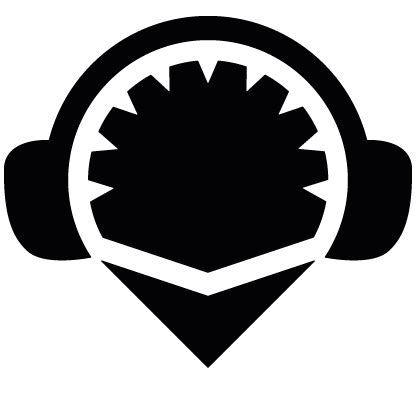
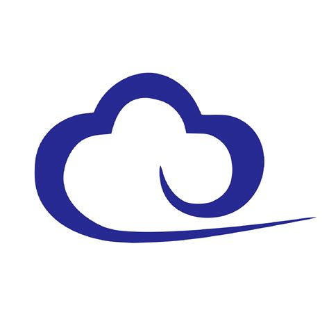

<h1 align="center">Hi 👋, I'm Kushal sapra</h1>
<h3 align="center">A passionate blockchain developer</h3>

- 🔭 I’m currently working on **Decentralized horoscope Dapp**

- 🌱 I’m currently learning **React, Next.js & Tenderly**

- 👯 I’m looking to collaborate on **Web 3.0** projects

- 💬 Ask me about **Solidity, Rust & blockchain**

- 🤖 Welcome to all **Web 3.0 enthusiasts** 

<h3 align="left">Connect with me:</h3>

<h3 align="left">Languages and Tools:</h3>

    <a href="https://book.getfoundry.sh/" target="_blank" rel="noreferrer">  <a href="https://remix.ethereum.org/" target="_blank" rel="noreferrer">   </a> </a>          

